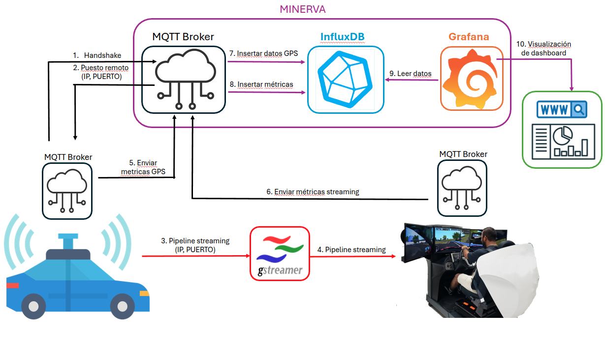

# GStreamer Grafana Metrics

This repository contains a small toolkit to stream metrics from RTMaps over MQTT and visualise them with InfluxDB and Grafana.  It was created as an example of how to publish GPS data and gstreamer information from a vehicle and monitor it from a teleoperation station.



## Repository layout

```
.
├── environment.yml             # Conda environment specification
├── grafana/                    # Grafana dashboards
│   └── teleoperation_info_dashboard.json
├── launch/                     # Helper shell scripts
├── rtmaps/
│   ├── diagrams/               # RTMaps diagrams (*.rtd)
│   └── scripts/                # RTMaps Python components
├── src/                        # Stand‑alone Python modules
└── docs/                       # Documentation (architecture diagram)
```

## Setting up the environment

1. Install [conda](https://conda.io/projects/conda/en/latest/user-guide/install/index.html) if it is not already available.
2. Create the environment and install all required packages:

```bash
conda env create -f environment.yml
```

3. Activate the environment whenever you work with this repository:

```bash
conda activate rtmaps
```

## Basic workflow

1. **Establish an MQTT handshake** between the vehicle and the teleoperation server.
   Start the server on the teleoperation side:

   ```bash
   python src/mqtt_handshake.py receive
   ```

   On the client (vehicle) run:

   ```bash
   python src/mqtt_handshake.py send
   ```

   Once the handshake succeeds, the client learns the teleoperation server IP and port.

2. **Stream GPS information** from RTMaps using MQTT.  Launch the sender inside RTMaps or run the script directly:

   ```bash
   python src/GPS_info_send_MQTT.py
   ```

   On the server side receive the data and store it in InfluxDB:

   ```bash
   python src/GPS_info_receive_MQTT.py
   ```

3. **Run RTMaps diagrams** if needed.  For example to open the GPS diagram:

   ```bash
   rtmaps_runtime --run rtmaps/diagrams/GPS_info.rtd
   ```

4. **Visualise the metrics** in Grafana using InfluxDB as data source.

## Loading the Grafana dashboard

1. Open your Grafana instance in a browser.
2. Choose *Import Dashboard* and upload the file `grafana/teleoperation_info_dashboard.json`.
3. Select the InfluxDB data source used to store the metrics.  Once imported you will see panels showing the received GPS information and other telemetry.

## Folder `launch/`

The `launch` directory contains example shell scripts used during development.  `handshake_client.sh` and `handshake_server.sh` start the handshake in client or server mode respectively.  `GPS_info_dashboard.sh` launches the receiver, RTMaps and opens the Grafana dashboard in a browser.

These scripts reference absolute paths and might need adjustments for your setup, but they illustrate how the pieces connect together.

